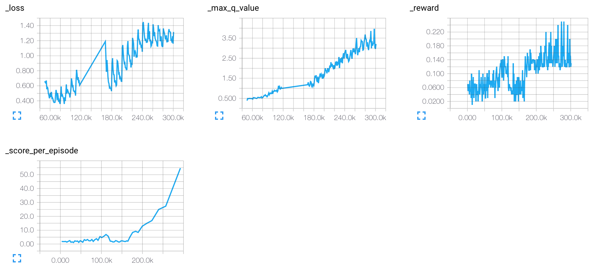
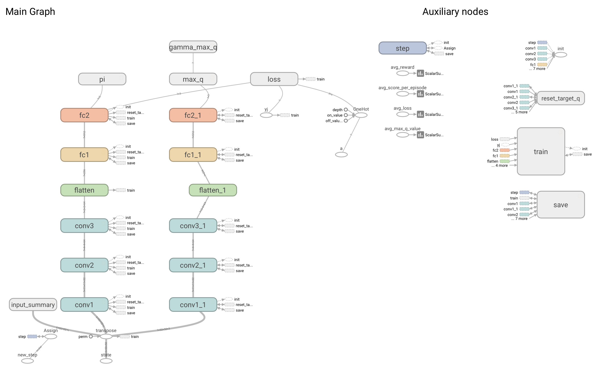

# simple_dqn
This is a scaled-down simple_dqn using tensorflow with a simple game.<br />
It took about 2~3 hours to play like an expert. (by only CPU, i7-4870HQ)<br />
I didn't skip any frames unlike the original DeepMind's paper.<br />

## How to train ##
`python simple_dqn.py` (python 3.5+ recommended)<br />
And you can check the agent's play on http://localhost:11100/

## Scalar values during training ##


## Scaled-down model ##
```
Input: 50x50x3 (3 successive black&white images)
CNN: 8x8x3x32
CNN: 4x4x32x64
CNN: 3x3x64x64
Full Connected1: 256->512
Full Connected2: 512->3
```

## Graph ##

